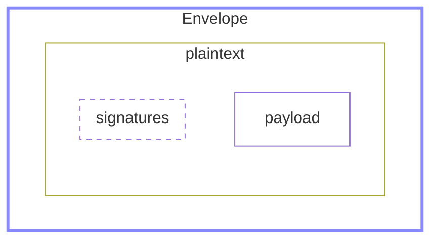
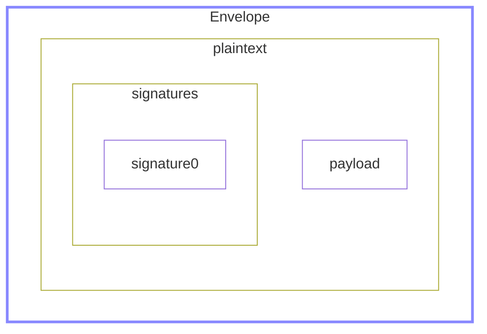
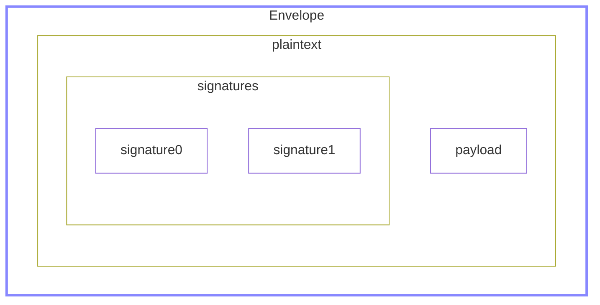
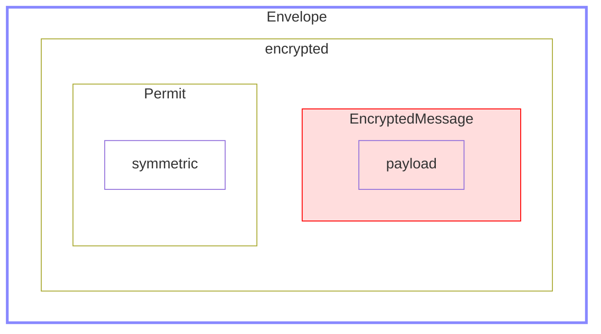
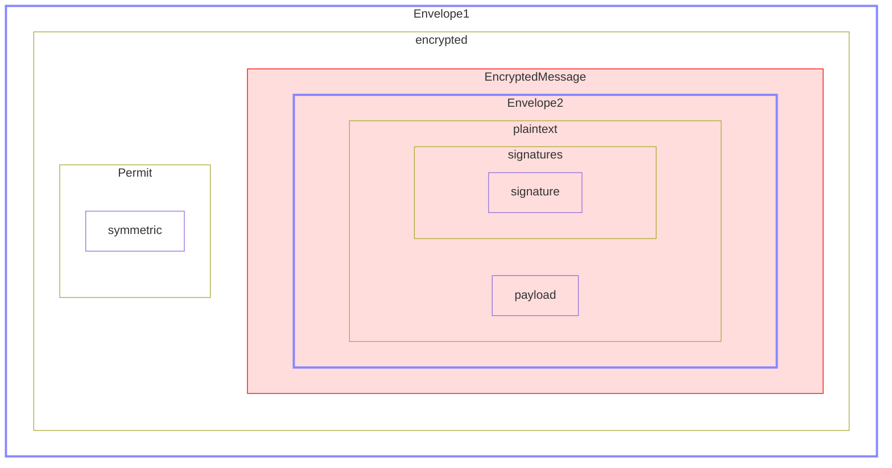
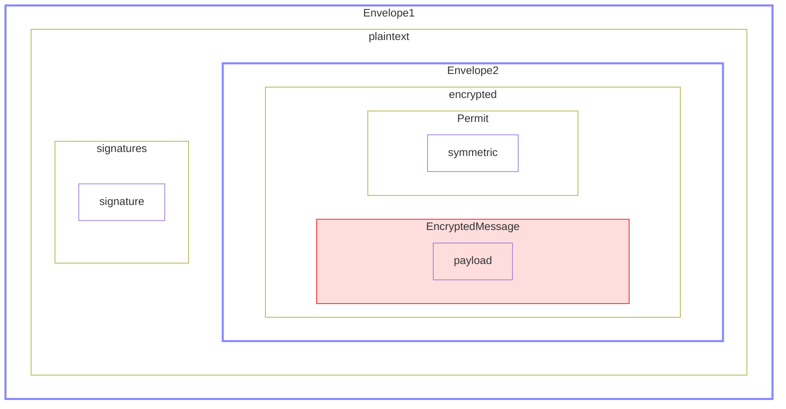
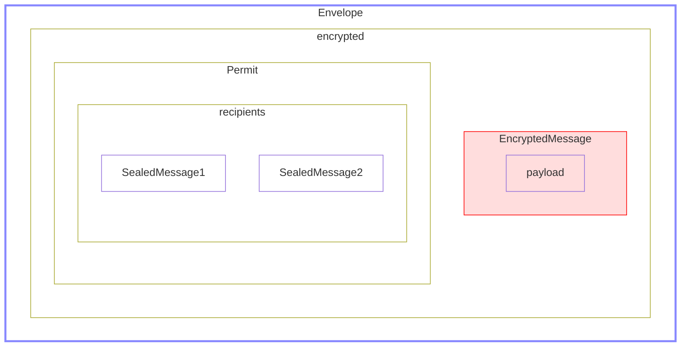
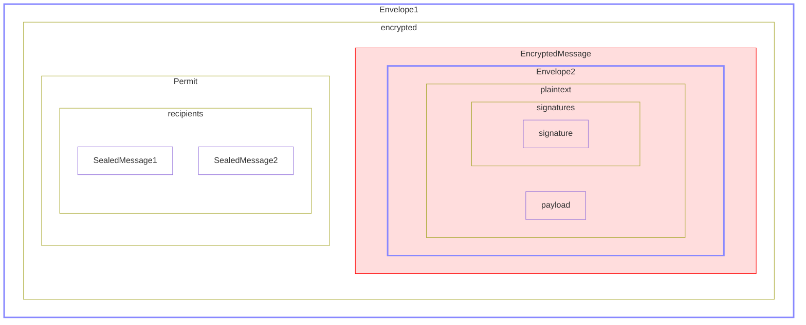
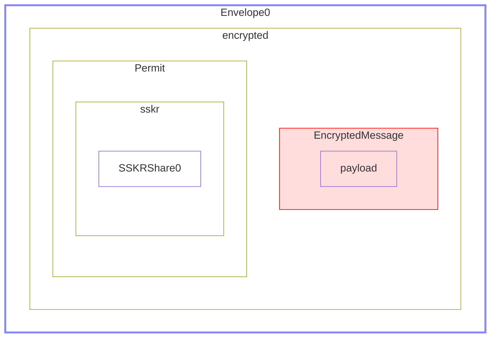
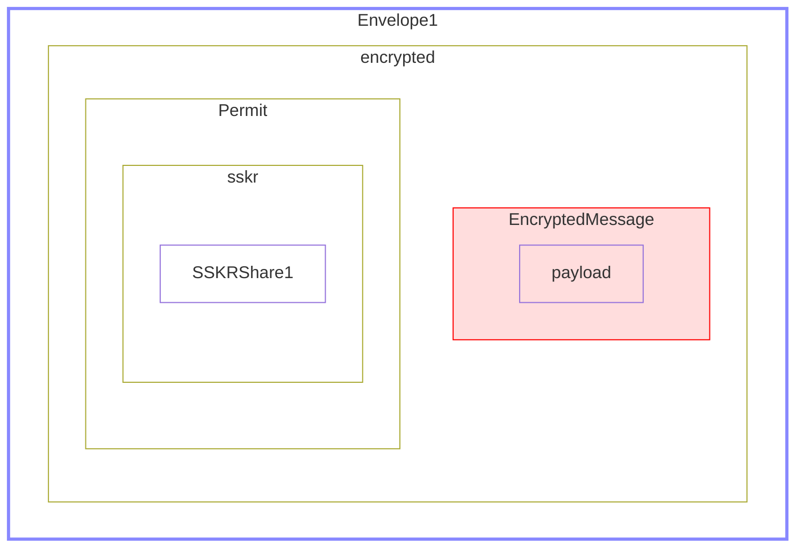

# Secure Components - Overview

**Authors:** Wolf McNally, Christopher Allen, Blockchain Commons</br>
**Revised:** March 28, 2022</br>
**Status:** DRAFT

---

## Contents

* Overview: This document.
* [Examples](2-EXAMPLES.md)
* [Definitions](3-DEFINITIONS.md)

---

## Introduction

The Secure Components suite provides tools for easily implementing encryption (symmetric or public key), signing, and sharding of messages, including serialization to and from [CBOR](https://cbor.io/), and [UR](https://github.com/BlockchainCommons/Research/blob/master/papers/bcr-2020-005-ur.md) formats.

## Status

**DRAFT.** There is a reference implementation in [BCSwiftFoundation](https://github.com/blockchaincommons/BCSwiftFoundation), but everything is still fluid and subject to change.

**⚠️ WARNING:** As of the date of this publication the CBOR tags in the range `48` through `51` and `55` are currently unallocated in the [IANA Registry of CBOR Tags](https://www.iana.org/assignments/cbor-tags/cbor-tags.xhtml). Blockchain Commons is applying for these number to be assigned to the CBOR specification herein, but because these numbers are in a range that is open to other applications, it may change. For now, these low-numbered tags MUST be understood as provisional and subject to change by all implementors.

## Goals

* Provide a minimal set of datatypes for representing common encryption constructions.
* Provide serialization of types to and from CBOR and UR.
* Base these types on algorithms and constructs that are considered best practices.
* Support innovative constructs like Sharded Secret Key Reconstruction (SSKR).
* Interoperate with structures of particular interest to blockchain and cryptocurrency developers, such as [seeds](https://github.com/BlockchainCommons/Research/blob/master/papers/bcr-2020-006-urtypes.md#cryptographic-seed-crypto-seed) and [HD keys](https://github.com/BlockchainCommons/Research/blob/master/papers/bcr-2020-007-hdkey.md).
* Allow for the future extension of functionality to include additional cryptographic algorithms and methods.
* Provide a reference API implementation in Swift that is easy to use and hard to abuse.

## Top-Level Types

The types defined in the Secure Components suite are designed to be minimal, simple to use, and composable. They can all be used independently, but are designed to work together. Here is a quick summary of these types:

* `Envelope` is the central "top level" type of Secure Components. It is a general container for messages that provides for encryption, signing, and sharding.

* `EncryptedMessage` is a symmetrically-encrypted message and is specified in full in [BCR-2022-001](https://github.com/BlockchainCommons/Research/blob/master/papers/bcr-2022-001-secure-message.md).

* `Identity` holds key material such as a Seed belonging to an identifiable entity, and can produce all the private and public keys needed to use this suite. It is usually only serialized for purposes of backup.

* `Peer` holds the public keys of an identifiable entity, and can be made public. It is not simply called a "public key" because it holds at least _two_ public keys: one for signing and another for encryption.

* `SealedMessage` is a message that has been one-way encrypted to a specific `Peer`, and is used to implement multi-recipient public key encryption using `Envelope`.

Many of the types defined herein are assigned CBOR tags for use when encoding these structures. The types in this section may be used embedded within larger structures as tagged CBOR, or as top-level objects in URs. Note that when encoding URs, a top-level CBOR tag is not used, as the UR type provides that information.

|CBOR Tag|UR Type|Swift Type|
|---|---|---|
|48|`crypto-msg`|`EncryptedMessage`|
|49|`crypto-envelope`|`Envelope`|
|50|`crypto-identity`|`Identity`|
|51|`crypto-peer`|`Peer`|
|55|`crypto-sealed`|`SealedMessage`|

## Tagged Types

Types that do not define a UR type generally would never be serialized as a top-level object, but are frequently serialized as part of a larger structure.

|CBOR Tag|Swift Type|
|---|---|
|700|`Digest`|
|701|`Password`|
|702|`Permit`|
|703|`PrivateAgreementKey`|
|704|`PrivateSigningKey`|
|705|`PublicAgreementKey`|
|706|`PublicSigningKey`|
|707|`Signature`|
|708|`SymmetricKey`|

## Untagged Types

A number of types are simply serialized as untagged CBOR byte strings. They do not need tags because they are used in contexts where their meaning is fixed and unlikely to change over time. These include:

* `AAD`
* `Auth`
* `Ciphertext`
* `Nonce`
* `Plaintext`
* `Salt`
* `Tag`

## Algorithms

The algorithms that Secure Components currently incorporates are listed below. The components include provisions for the future inclusion of additional algorithms and methods.

* **Hashing:** [Blake2b](https://datatracker.ietf.org/doc/rfc7693)
* **Signing:** [BIP-340 Schnorr](https://github.com/bitcoin/bips/blob/master/bip-0340.mediawiki)
* **Symmetric Encryption:** [IETF-ChaCha20-Poly1305](https://datatracker.ietf.org/doc/html/rfc8439)
* **Public Key Encryption:** [X25519](https://datatracker.ietf.org/doc/html/rfc7748)
* **Key Derivation**: [HKDF-SHA-512](https://datatracker.ietf.org/doc/html/rfc5869)
* **Password-Based Key Derivation**: [scrypt](https://datatracker.ietf.org/doc/html/rfc7914)
* **Sharding**: [SSKR (Sharded Secret Key Reconstruction)](https://github.com/BlockchainCommons/Research/blob/master/papers/bcr-2020-011-sskr.md)

## Structure of the Envelope

An `Envelope` allows for flexible signing, encryption, and sharding of messages. Here is its definition in Swift:

```swift
public enum Envelope {
    case plaintext(Data, [Signature])
    case encrypted(EncryptedMessage, Permit)
}
```

It is an enumerated type with two cases: `.plaintext` and `.encrypted`.

* If `.plaintext` is used, it may also carry one or more signatures.
* If `.encrypted` is used, the `EncryptedMessage` is accompanied by a `Permit` that defines the conditions under which the `EncryptedMessage` may be decrypted.

To facilitate further decoding, it is RECOMMENDED that the payload of an `Envelope` should itself be tagged CBOR.

`Envelope` can contain as its payload another CBOR-encoded `Envelope`. This facilitates both sign-then-encrypt and encrypt-then sign constructions. The reason why `.plaintext` messages may be signed and `.encrypted` messages may not is that generally a signer should have access to the content of what they are signing, therefore this design encourages the sign-then-encrypt order of operations. If encrypt-then-sign is preferred, then this is easily accomplished by creating an `.encrypted` and then enclosing that envelope in a `.plaintext` with the appropriate signatures.

A `Permit` specifies the conditions under which an `EncryptedMessage` may be decrypted, and contains three cases:

```swift
public enum Permit {
    case symmetric
    case recipients([SealedMessage])
    case share(SSKRShare)
}
```

* `.symmetric` means that the `EncryptedMessage` was encrypted with a `SymmetricKey` that the receiver is already expected to have.
* `.recipients` facilitates multi-recipient public key cryptography by including an array of `SealedMessage`, each of which is encrypted to a particular recipient's public key, and which contains an ephemeral key that can be used by a recipient to decrypt the main message.
* `.share` facilitates social recovery by pairing an `EncryptedMessage` encrypted with an ephemeral key with an `SSKRShare`, and providing for the production of a set of `Envelope`s, each one including a different share. Only an M-of-N threshold of shares will allow the recovery of the ephemeral key and hence the decryption of the original message. Each recipient of one of these `Envelope`s will have an encrypted backup of the entire original `EncryptedMessage`, but only a single `SSKRShare`.

This structure provides a flexible framework for constructing solutions to various applications. Here are some high-level schematics of such applications. See the EXAMPLES chapter for more detail.

### "An envelope containing plaintext."



### "An envelope containing signed plaintext."



### "An envelope containing plaintext signed by several parties."



### "An envelope containing an encrypted message."



### "An encrypted envelope containing a signed envelope."



### "A signed envelope containing an encrypted envelope."



### "An envelope that can only be opened by specific receivers."



### "A signed envelope that can only be opened by specific receivers."



### "Several envelopes containing a seed split into several SSKR shares."






