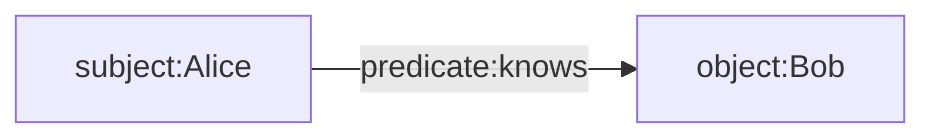

# Secure Components - Overview

**Authors:** Wolf McNally, Christopher Allen, Blockchain Commons</br>
**Revised:** March 28, 2022</br>
**Status:** DRAFT

---

## Contents

* Overview: This document.
* [Examples](2-EXAMPLES.md)
* [Definitions](3-DEFINITIONS.md)

---

## Introduction

The Secure Components suite provides tools for easily implementing encryption (symmetric or public key), signing, and sharding of messages, including serialization to and from [CBOR](https://cbor.io/), and [UR](https://github.com/BlockchainCommons/Research/blob/master/papers/bcr-2020-005-ur.md) formats.

## Status

**DRAFT.** There is a reference implementation in [BCSwiftFoundation](https://github.com/blockchaincommons/BCSwiftFoundation), but everything is still fluid and subject to change.

**⚠️ WARNING:** As of the date of this publication the CBOR tags in the range `48` through `51` and `55` are currently unallocated in the [IANA Registry of CBOR Tags](https://www.iana.org/assignments/cbor-tags/cbor-tags.xhtml). Blockchain Commons is applying for these number to be assigned to the CBOR specification herein, but because these numbers are in a range that is open to other applications, it may change. For now, these low-numbered tags MUST be understood as provisional and subject to change by all implementors.

## Goals

The goal is to create a general purpose, composable suite of data types that:

* Are based on object-centric architecture
* Make it easy to represent common encryption constructions
* Are based on algorithms and constructs that are considered best practices.
* Allow for the future extension of functionality to include additional cryptographic algorithms and methods.
* Represent structured data using [CBOR](https://cbor.io/) and [UR](https://github.com/BlockchainCommons/Research/blob/master/papers/bcr-2020-005-ur.md).
* Support innovative constructs like [Sharded Secret Key Reconstruction (SSKR)](https://github.com/BlockchainCommons/Research/blob/master/papers/bcr-2020-011-sskr.md).
* Interoperate with structures of particular interest to blockchain and cryptocurrency developers, such as [seeds](https://github.com/BlockchainCommons/Research/blob/master/papers/bcr-2020-006-urtypes.md#cryptographic-seed-crypto-seed) and [HD keys](https://github.com/BlockchainCommons/Research/blob/master/papers/bcr-2020-007-hdkey.md).
* Support protocols like [Distributed Identifiers](https://www.w3.org/TR/did-core/).
* Support complex metadata (assertions about assertions).
* Support semantic knowledge graphs.
* Support mutable and immutable architectures.
* Provide a reference API implementation in Swift that is easy to use and hard to abuse.

Other goals we are considering include:

* Support eventual consistency using [conflict-free replicated datatypes (CRDTs)](https://en.wikipedia.org/wiki/Conflict-free_replicated_data_type)
* Minimize opportunities for correlation without first demonstrating ability to decrypt or provide an adapter signature.
* Correlation resistance leveraging similarities between UUIDs, nonces, hashes, content addressable hashes, signatures, etc.
* Focus first on peer-based, web-of-trust, self-sovereign key models for roots of trust, where peers may be groups.
* Support “Progressive Trust” models:
    * Progressive trust is the ability of an individual to gradually increase the amount of relevant data revealed as trust is built or value generated.
    * [W3C Data Minimization](https://w3c-ccg.github.io/data-minimization/#progressive-trust)
    * [Original concept](http://www.lifewithalacrity.com/2004/08/progressive_tru.html)
* Default and fundamental support of aggregated group multisig signatures, in particular prime-order curves like secp256k1, or point-compressed cofactor solutions like [ristretto255](https://www.ietf.org/archive/id/draft-irtf-cfrg-ristretto255-00.html):
    * Reason? Multisig attacks:
        * [Prime, Order Please! - Revisiting Small Subgroup and Invalid Curve Attacks on Protocols using Diffie-Hellman](https://eprint.iacr.org/2019/526.pdf)
        * [Cofactor Explained: Clearing Elliptic Curves' dirty little secret](https://loup-vaillant.fr/tutorials/cofactor)
        * [Attack on Monero using 25519](https://jonasnick.github.io/blog/2017/05/23/exploiting-low-order-generators-in-one-time-ring-signatures/)
* Fundamental support for redactable signatures, possibly:
    * Bauer, Blough, Cash - [Minimal Information Disclosure with Efficiently Verifiable Credentials](https://citeseerx.ist.psu.edu/viewdoc/download?doi=10.1.1.153.8662&rep=rep1&type=pdf)
* Support for various modern techniques like signature aggregation (Musig2 m of m), threshold signatures (FROST n of m), adapter signatures, scriptless scripts, discrete log contracts, Brandian blind signatures (and improvements), smart signature scripts, distributed key generation & verifiable secret sharing

---

## Top-Level Types

The types defined in the Secure Components suite are designed to be minimal, simple to use, and composable. They can all be used independently, but are designed to work together. Here is a quick summary of these types:

* `Simplex` is the central "top level" type of Secure Components. It is a "simple container for complex concepts" supporting everything from enclosing the most basic of plaintext messages, to innumerable recursive permutations of encryption, signing, sharding, and representing semantic graphs.
* `EncryptedMessage` is a symmetrically-encrypted message and is specified in full in [BCR-2022-001](https://github.com/BlockchainCommons/Research/blob/master/papers/bcr-2022-001-secure-message.md).
* `PrivateKeyBase` holds key material such as a Seed belonging to an identifiable entity, and can produce all the private and public keys needed to use this suite. It is usually only serialized for purposes of backup.
* `PublicKeyBase` holds the public keys of an identifiable entity, and can be made public. It is not simply called a "public key" because it holds at least _two_ public keys: one for signing and another for encryption.
* `SealedMessage` is a message that has been one-way encrypted to a specific `PublicKeyBase`, and is used to implement multi-recipient public key encryption using `Envelope`.
* `Digest` is a cryptographic hash that uniquely identifies an immutable binary object.
* `SCID` is a "self-certifying identifier" that uniquely identifies a mutable set of traits.

Many of the types defined herein are assigned CBOR tags for use when encoding these structures. The types in this section may be used embedded within larger structures as tagged CBOR, or as top-level objects in URs. Note that when encoding URs, a top-level CBOR tag is not used, as the UR type provides that information.

|CBOR Tag|UR Type|Swift Type|
|---|---|---|
|48|`crypto-msg`|`EncryptedMessage`|
|49|`crypto-simplex`|`Simplex`|
|50|`crypto-prvkeys`|`PrivateKeyBase`|
|51|`crypto-pubkeys`|`PublicKeyBase`|
|55|`crypto-sealed`|`SealedMessage`|
|56|`crypto-digest`|`Digest`|
|57|`crypto-key`|`SymmetricKey`|
|58|`crypto-scid`|`SCID`|

## Tagged Types

Types that do not define a UR type generally would never be serialized as a top-level object, but are frequently serialized as part of a larger structure. The `Predicate` type has a single-byte CBOR tag due to its frequency of use in the `Simplex` type.

|CBOR Tag|Swift Type|
|---|---|
|59|`Predicate`|
|700|`Password`|
|701|`Permit`|
|702|`AgreementPrivateKey`|
|703|`AgreementPublicKey`|
|704|`SigningPrivateKey`|
|705|`SigningPublicKey`|
|706|`Signature`|
|707|`Nonce`|

## Untagged Types

A number of types are simply serialized as untagged CBOR byte strings. They do not need tags because they are used in contexts where their meaning is fixed and unlikely to change over time. These include:

* `AAD`
* `Auth`
* `Ciphertext`
* `Plaintext`
* `Salt`
* `Tag`

For example, a field called `Auth` is currently only used in the context of the IETF-ChaCha20-Poly1305 encryption algorithm, and therefore does not need to be specifically tagged. If another algorithm also needed a field called `Auth`, it would be used in the context of *that* algorithm, and the two fields would not be considered interchangeable.

## Algorithms

The algorithms that Secure Components currently incorporates are listed below. The components include provisions for the future inclusion of additional algorithms and methods.

* **Hashing:** [Blake2b](https://datatracker.ietf.org/doc/rfc7693)
* **Signing:** [BIP-340 Schnorr](https://github.com/bitcoin/bips/blob/master/bip-0340.mediawiki) or [ECDSA-25519-doublesha256](https://en.bitcoin.it/wiki/BIP_0137)
* **Symmetric Encryption:** [IETF-ChaCha20-Poly1305](https://datatracker.ietf.org/doc/html/rfc8439)
* **Public Key Encryption:** [X25519](https://datatracker.ietf.org/doc/html/rfc7748)
* **Key Derivation**: [HKDF-SHA-512](https://datatracker.ietf.org/doc/html/rfc5869)
* **Password-Based Key Derivation**: [scrypt](https://datatracker.ietf.org/doc/html/rfc7914)
* **Sharding**: [SSKR (Sharded Secret Key Reconstruction)](https://github.com/BlockchainCommons/Research/blob/master/papers/bcr-2020-011-sskr.md)

## Overview of the Simplex Type

A `Simplex` is a "simple container for complex concepts" supporting everything from enclosing the most basic of plaintext messages, to innumerable recursive permutations of encryption, signing, sharding, and representing semantic graphs. Here is its (slightly simplified) definition in Swift:

```swift
struct Simplex {
    let subject: Subject
    let assertions: [Assertion]
}
```

The basic idea is that a `Simplex` contains some [deterministically-encoded CBOR](https://www.rfc-editor.org/rfc/rfc8949.html#name-deterministically-encoded-c) data (the `subject`) that may or may not be encrypted, and zero or more assertions about the `subject`.

### Subject

The `Subject` of a `Simplex` is an enumerated type. `.leaf` represents any terminal CBOR object. `.simplex` represents a nested `Simplex`, and `.encrypted` represents an `EncryptedMessage` that could be a `.leaf` or a `.simplex`.

```swift
enum Subject {
    case leaf(CBOR)
    case simplex(Simplex)
    case encrypted(EncryptedMessage)
}
```

### Assertion

`Assertion`s are `predicate`-`object` pairs that supply additional information about the `subject`.

```swift
struct Assertion {
    let predicate: Simplex
    let object: Simplex
}
```

Combining the `subject` of a `Simplex` with the `predicate` and `object` of an assertion forms a [semantic triple](https://en.wikipedia.org/wiki/Semantic_triple), which may be part of a larger knowledge graph:



The `predicate` and `object` are themselves `Simplex`es, and thus may also be encrypted, and may in turn contain their own assertions. It is therefore possible to hide any part of an assertion by encrypting its parts:

* You can of course encrypt the `subject` about which assertions are made.
* You can encrypt the `predicate` to reveal that the `subject` and `object` are related, but hide *how* they are related,
* You can encrypt the `object` to assert that the subject is related in a specific way to some other hidden object,
* You can hide every part of the assertion by encrypting the `subject`, `predicate`, and `object` separately, while still revealing that an assertion *exists*,
* Finally, you can hide even the fact of the assertion's existence by making the `subject` an `EncryptedMessage` containing a `Simplex` with its assertions encrypted along with it.

It is important to understand that because `Simplex` supports "complex metadata", i.e., "assertions with assertions," users are not limited to semantic triples. Adding context, as in a [semantic quad](https://en.wikipedia.org/wiki/Named_graph#Named_graphs_and_quads), is easily accomplished with an assertion on the subject. In fact, any Simplex can also be an element of a [cons pair](https://en.wikipedia.org/wiki/Cons), with the "first" element being the `subject` and the "rest" being the assertions. And since the `subject` of a `Simplex` can be any CBOR object, a `subject` can also be any structure (such as an array or map) containing other `Simplex`es.

## Digests

Each `Simplex` produces an associated `Digest`, such that if the `subject` and `assertions` of the `Simplex` are semantically identical, then the same `Digest` must necessarily be calculated.

Because the order of concatenating items for a hash affects the resulting hash, the order of the elements in the `assertions` array is determined by sorting them lexicographically by the `Digest` of each assertion, and disallowing identical assertions. This ensures that an identical `subject` with identical `assertions` will yield the same `Simplex` digest, and `Simplex`s containing other `Simplex`s will yield the same digest tree.

Thus the `Digest` of a `Simplex` identifies the `subject` and its assertions as if they were all present and decrypted, allowing a `Simplex` to be transformed either into or out of the various encrypted/decrypted and local/reference cases without changing the cumulative tree of digests. This also means that any transformations that do not preserve the digest tree invalidate the signatures of enclosing `Simplex`s.

This also allows selective disclosure of contents of nested `Simplex`s by revealing only the sequence of keys necessary to decrypt a particular nesting path, and having done so, calculating the hashes back to the root allows verification that the correct and included contents were disclosed.

## Signatures

Signatures have a random component, so anything with a signature will have a non-deterministic digest. Therefore, the two results of signing the same object twice with the same private key will not compare as equal, even if the same binary obect was signed by the same private key. This means that each signing is a particular event that can never be repeated.

## Simplex Notation

A simplified textual notation for interpreting `Simplex`es is provided:

* Braces `{ }` are used to delimit the contents of a `Simplex`.
* Top-level braces representing the outermost `Simplex` are omitted.
* Square brackets `[ ]` may come after the `subject` of a `Simplex` and are used to delimit the list of `Assertion`s.
* Type names, enumeration cases, and empty assertion lists that are obvious from context are elided.

For example, instead of writing:

```
{
    subject: .leaf("Hello"),
    assertions: [ ]
}
```

we simply write:

```
"Hello"
```

If we were to output the [CBOR diagnostic notation](https://www.rfc-editor.org/rfc/rfc8949.html#name-diagnostic-notation) for the above, we'd see:

```
49(
   60("Hello")
)
```

`49` is the CBOR tag for `Simplex` and `60` is the tag for `.leaf`. Wrapping this 5-byte UTF-8 string in a `Simplex` only adds 2 bytes (1 for each tag) and 1 byte that identifies the string's type and length, for a total of 8 bytes. CBOR (and hence `Simplex`) is therefore completely self-describing.

`Simplex` provides a flexible framework for constructing solutions for various applications. Here are some high-level schematics of such applications in Simplex Notation. See the EXAMPLES chapter for more detail.

---

### "An envelope containing plaintext."

```
"Hello."
```

---

### "An envelope containing signed plaintext."

This is the `.leaf` string with a single `Assertion` whose predicate is a well-known integer with a CBOR tag meaning `predicate`, while the object is a `Signature`.

```
"Hello." [
    authenticatedBy: Signature
]
```

---

### "An envelope containing plaintext signed by several parties."

Although you cannot have duplicate assertions every signature is unique, hence these are two *different* assertions.

```
"Hello." [
    authenticatedBy: Signature
    authenticatedBy: Signature
]
```

---

### "An envelope containing a symmetrically encrypted message."

The subject is just an `EncryptedMessage`. This message may or may not be signed or contain many other layers, but the receiver will have to decrypt it to find out.

```
EncryptedMessage
```

---

### "A message that has been encrypted then signed."

The sender has first encrypted a message, then signed it. The signature can be verified before the actual message is decrypted.

```
EncryptedMessage [
    authenticatedBy: Signature
]
```

---

### "An message that can only be opened by specific receivers."

An ephemeral "content key" has been used to encrypt the message and the content key itself has been encrypted to one or more receipients' public keys. Therefore, only the intended recipients can decrypt and read the message, without the sender and receivers having to exchange a secret symmetric key first.

```
EncryptedMessage [
    hasRecipient: SealedMessage
    hasRecipient: SealedMessage
]
```

---

### "A signed envelope that can only be opened by specific receivers."

As before, the signature can be outside the `subject` message, as below, or inside it, requiring decryption before validation.

```
EncryptedMessage [
    authenticatedBy: Signature
    hasRecipient: SealedMessage
    hasRecipient: SealedMessage
]
```

---

### "Several Simplexes containing a message split into several SSKR shares."

A message has been split into a three shares using SSKR and distributed to three trustees. Two of these shares must be recovered to reconstruct the original message.

```
EncryptedMessage [
    sskrShare: SSKRShare
]

EncryptedMessage [
    sskrShare: SSKRShare
]

EncryptedMessage [
    sskrShare: SSKRShare
]
```

---

### Complex Metadata

A specific digital object is identified and several layers of metadata are attributed to it. In this example some predicates are specified as strings (indicated by quotes) whiile other predicates use tagged well-known integers.

```
Digest(886d35d99ded5e20c61868e57af2f112700b73f1778d48284b0e078503d00ac1) [
    "format": "EPUB"
    "work": SCID(7fb90a9d96c07f39f75ea6acf392d79f241fac4ec0be2120f7c82489711e3e80) [
        "author": SCID(9c747ace78a4c826392510dd6285551e7df4e5164729a1b36198e56e017666c8) [
            dereferenceVia: "LibraryOfCongress"
            hasName: "Ayn Rand"
        ]
        "isbn": "9780451191144"
        dereferenceVia: "LibraryOfCongress"
        hasName: "Atlas Shrugged" [
            language: "en"
        ]
        hasName: "La rebelión de Atlas" [
            language: "es"
        ]
        isA: "novel"
    ]
    dereferenceVia: "IPFS"
]
```
