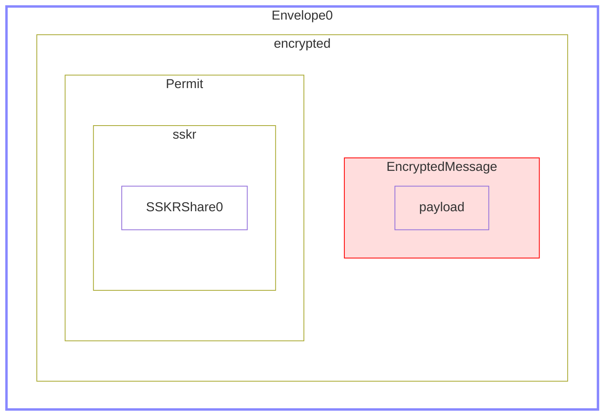

# Secure Components - Examples

**Authors:** Wolf McNally, Christopher Allen, Blockchain Commons</br>
**Revised:** March 28, 2022</br>
**Status:** DRAFT

---

## Contents

* [Overview](1-OVERVIEW.md)
* Examples: This document.
* [Definitions](3-DEFINITIONS.md)

---

## Introduction

This section includes a set of high-level examples of API usage in Swift involving `Envelope`, including example CBOR and UR output. These examples are actual, running unit tests in the [BCSwiftFoundation package](https://github.com/blockchaincommons/BCSwiftFoundation).

## Common structures used by the examples

The unit tests define a common plaintext, and three separate `PrivateKeyBase` objects for *Alice*, *Bob*, and *Carol*, each with a corresponding `PublicKeyBase`.

```swift
  static let plaintext = "Some mysteries aren't meant to be solved.".utf8Data

  static let aliceSeed = Seed(data: ‡"82f32c855d3d542256180810797e0073")!
  static let alicePrivateKeyBase = PrivateKeyBase(aliceSeed, salt: "Salt")
  static let alicePublicKeyBase = PublicKeyBase(prvkeys: alicePrivateKeyBase)

  static let bobSeed = Seed(data: ‡"187a5973c64d359c836eba466a44db7b")!
  static let bobPrivateKeyBase = PrivateKeyBase(bobSeed, salt: "Salt")
  static let bobPublicKeyBase = PublicKeyBase(prvkeys: bobPrivateKeyBase)

  static let carolSeed = Seed(data: ‡"8574afab18e229651c1be8f76ffee523")!
  static let carolPrivateKeyBase = PrivateKeyBase(carolSeed, salt: "Salt")
  static let carolPublicKeyBase = PublicKeyBase(prvkeys: carolPrivateKeyBase)
```

A `PrivateKeyBase` is derived from a source of key material such as a `Seed`, an `HDKey`, or a `Password` that produces key material using the Scrypt algorithm, and also includes a random `Salt`.

A `PrivateKeyBase` is kept secret, and can produce both private and public keys for signing and encryption. A `PublicKeyBase` is just the public keys and `Salt` extracted from a `PrivateKeyBase` and can be made public. Signing and public key encryption is performed using the `PrivateKeyBase` of one party and the `PublicKeyBase` from another.

**Note:** Due to the use of randomness in the cryptographic constructions, separate runs of the code are extremly unlikely to replicate the exact CBOR and URs below.

## Example 1: Plaintext

In this example no signing or encryption is performed.

```swift
// Alice sends a plaintext message to Bob.
let envelope = Envelope(plaintext: Self.plaintext)
let ur = envelope.ur

// ➡️ ☁️ ➡️

// Bob receives the envelope.
let receivedEnvelope = try Envelope(ur: ur)
// Bob reads the message.
XCTAssertEqual(receivedEnvelope.plaintext, Self.plaintext)
```

### Schematic

> "An envelope containing plaintext."


### CBOR Diagnostic Notation

```
49(                 # Envelope
   [
      1,            # type 1: plaintext
      h'536f6d65206d7973746572696573206172656e2774206d65616e7420746f20626520736f6c7665642e', # payload
      []            # signatures
   ]
)
```

### Annotated CBOR

```
d8 31                                    # tag(49): Envelope
   83                                    # array(3)
      01                                 # unsigned(1): type 1: plaintext
      5829                               # bytes(41): payload
         536f6d65206d7973746572696573206172656e2774206d65616e7420746f20626520736f6c7665642e # "Some mysteries aren't meant to be solved."
      80                                 # array(0): signatures
```

### UR

```
ur:crypto-envelope/lsadhddtgujljnihcxjnkkjkjyihjpinihjkcxhsjpihjtdijycxjnihhsjtjycxjyjlcxidihcxjkjljzkoihiedmladnvsrysa
```

## Example 2: Signed Plaintext

```swift
// Alice sends a signed plaintext message to Bob.
let envelope = Envelope(plaintext: Self.plaintext, signer: Self.alicePrivateKeyBase)
let ur = envelope.ur

// ➡️ ☁️ ➡️

// Bob receives the envelope.
let receivedEnvelope = try Envelope(ur: ur)
// Bob receives the message and verifies that it was signed by Alice.
XCTAssertTrue(receivedEnvelope.hasValidSignature(from: Self.alicePublicKeyBase))
// Confirm that it wasn't signed by Carol.
XCTAssertFalse(receivedEnvelope.hasValidSignature(from: Self.carolPublicKeyBase))
// Confirm that it was signed by Alice OR Carol.
XCTAssertTrue(receivedEnvelope.hasValidSignatures(from: [Self.alicePublicKeyBase, Self.carolPublicKeyBase], threshold: 1))
// Confirm that it was not signed by Alice AND Carol.
XCTAssertFalse(receivedEnvelope.hasValidSignatures(from: [Self.alicePublicKeyBase, Self.carolPublicKeyBase], threshold: 2))

// Bob reads the message.
XCTAssertEqual(receivedEnvelope.plaintext, Self.plaintext)
```

### Schematic

> "An envelope containing signed plaintext."


### CBOR Diagnostic Notation

```
49(                 # Envelope
   [
      1,            # type 1: Plaintext
      h'536f6d65206d7973746572696573206172656e2774206d65616e7420746f20626520736f6c7665642e',
      [             # signatures
         707(       # Signature
            [
               1,   # type 1: Schnorr
               h'1c97a6fbe5450f45da51594ce71ecb81338d2286e41af13563faa393f0d5875c52a31e1c29763c559fb398f51ae1761c12c2f08842a2a7dfffc18cb660194649',
               h''  # tag
            ]
         )
      ]
   ]
)
```

### Annotated CBOR

```
d8 31                                    # tag(49):         Envelope
   83                                    # array(3)
      01                                 # unsigned(1):     type 1: Plaintext
      5829                               # bytes(41):       payload
         536f6d65206d7973746572696573206172656e2774206d65616e7420746f20626520736f6c7665642e # "Some mysteries aren't meant to be solved."
      81                                 # array(1):        signatures
         d9 02c3                         # tag(707):        Signature
            83                           # array(3)
               01                        # unsigned(1):     type 1: Schnorr
               5840                      # bytes(64)
                  1c97a6fbe5450f45da51594ce71ecb81338d2286e41af13563faa393f0d5875c52a31e1c29763c559fb398f51ae1761c12c2f08842a2a7dfffc18cb660194649
               40                        # bytes(0):        tag
```

### UR

```
ur:crypto-envelope/lsadhddtgujljnihcxjnkkjkjyihjpinihjkcxhsjpihjtdijycxjnihhsjtjycxjyjlcxidihcxjkjljzkoihiedmlytaaosrlsadhdfzcemsolzovwfebsfetngyhkgsvdcksblyeolgcplnvecywneciazsotmuwttllthhgmotckcedtkofngoneqdmkykcyvykocebgsawtlofwoeosurzmselkrphncffggafzskwmvtox
```

## Example 3: Multisigned Plaintext

```swift
// Alice and Carol jointly send a signed plaintext message to Bob.
let envelope = Envelope(plaintext: Self.plaintext, signers: [Self.alicePrivateKeyBase, Self.carolPrivateKeyBase])
let ur = envelope.ur

// ➡️ ☁️ ➡️

// Bob receives the envelope.
let receivedEnvelope = try Envelope(ur: ur)

// Bob verifies the message was signed by both Alice and Carol.
XCTAssertTrue(receivedEnvelope.hasValidSignatures(from: [Self.alicePublicKeyBase, Self.carolPublicKeyBase]))

// Bob reads the message.
XCTAssertEqual(receivedEnvelope.plaintext, Self.plaintext)
```

### Schematic

> "An envelope containing plaintext signed by several parties."


### CBOR Diagnostic Notation

```
49(                     # Envelope
   [
      1,                # type 1: Plaintext
      h'536f6d65206d7973746572696573206172656e2774206d65616e7420746f20626520736f6c7665642e',
      [                 # signatures
         707(           # Signature
            [
               1,       # type 1: Schnorr
               h'4bd7af240bd6206d92c365ce610436d04f7e86b4385471fd7e671d476b0a4a46c2d95d48adc49f2cb380f0245d3b0c5a12e2d483216f8c806e8e05e1af85e92b',
               h''      # tag
            ]
         ),
         707(           # Signature
            [
               1,       # type 1: Schnorr
               h'af67970cc974a32f012919abe17e7f53de91f009ac799fda55b9012f79dd6cf29df0de42be476aed7cfbbe540271cdbedd526e1cf722db7a30c4ad1ec46376ba',
               h''      # tag
            ]
         )
      ]
   ]
)
```

### Annotated CBOR

```
d8 31                                    # tag(49):         Envelope
   83                                    # array(3)
      01                                 # unsigned(1):     type 1: Plaintext
      5829                               # bytes(41):       payload
         536f6d65206d7973746572696573206172656e2774206d65616e7420746f20626520736f6c7665642e # "Some mysteries aren't meant to be solved."
      82                                 # array(2):        signatures
         d9 02c3                         # tag(707):        Signature
            83                           # array(3)
               01                        # unsigned(1):     type 1: Schnorr
               5840                      # bytes(64)
                  4bd7af240bd6206d92c365ce610436d04f7e86b4385471fd7e671d476b0a4a46c2d95d48adc49f2cb380f0245d3b0c5a12e2d483216f8c806e8e05e1af85e92b
               40                        # bytes(0):        tag

         d9 02c3                         # tag(707):        Signature
            83                           # array(3)
               01                        # unsigned(1):     type 1: Schnorr
               5840                      # bytes(64)
                  af67970cc974a32f012919abe17e7f53de91f009ac799fda55b9012f79dd6cf29df0de42be476aed7cfbbe540271cdbedd526e1cf722db7a30c4ad1ec46376ba
               40                        # bytes(0):        tag
```

### UR

```
ur:crypto-envelope/lsadhddtgujljnihcxjnkkjkjyihjpinihjkcxhsjpihjtdijycxjnihhsjtjycxjyjlcxidihcxjkjljzkoihiedmlftaaosrlsadhdfzgrtspedkbdtbcxjnmosrihtohsaaentigwkblnqzetghjszckbiocafljebkgefgsatahlfdpmssnedwqdlawtdkhlfrbnhtbgvotylscljllklajtmnahvypelpwldnfztaaosrlsadhdfzpeiomsbnsojyotdladdtcfpyvykblbguuemewtaspskknetngorhaddlkkutjzwzntwtuefwrnflimwekezornghaojssnrnutgmjtceylcpuykndysspmckssiakordfzontotazm
```

## Example 4: Symmetric Encryption

```swift
// Alice and Bob have agreed to use this key.
let key = SymmetricKey()

// Alice sends a message encrypted with the key to Bob.
let envelope = Envelope(plaintext: Self.plaintext, key: key)
let ur = envelope.ur

// ➡️ ☁️ ➡️

// Bob receives the envelope.
let receivedEnvelope = try Envelope(ur: ur)

// Bob decrypts and reads the message.
XCTAssertEqual(receivedEnvelope.plaintext(with: key), Self.plaintext)

// Can't read with no key.
XCTAssertNil(receivedEnvelope.plaintext)

// Can't read with incorrect key.
XCTAssertNil(receivedEnvelope.plaintext(with: SymmetricKey()))
```

### Schematic

> "An envelope containing a encrypted message."


### CBOR Diagnostic Notation

```
49(                                                 # Envelope
   [
      2,                                            # type 2: encrypted
      48(                                           # EncryptedMessage
         [
            1,                                      # type 1: IETF-ChaCha20-Poly1305
            h'ec9faf81af0c7c6e27f6625a1286f7d5be106b806d60f7148d7746a5a8047012797217dbec56d8a577', # ciphertext
            h'',                                    # aad
            h'f5c5440156a817178da89c9a',            # nonce
            h'b8cff57f722dfa88dbde8e55e0647bac'     # auth
         ]
      ),
      702(                                          # Permit
         [1]                                        # type 1: symmetric
      )
   ]
)
```

### Annotated CBOR

```
d8 31                                    # tag(49):         Envelope
   83                                    # array(3)
      02                                 # unsigned(2):     type 2: encrypted
      d8 30                              # tag(48):         EncryptedMessage
         85                              # array(5)
            01                           # unsigned(1):     type 1: IETF-ChaCha20-Poly1305
            5829                         # bytes(41):       ciphertext
               ec9faf81af0c7c6e27f6625a1286f7d5be106b806d60f7148d7746a5a8047012797217dbec56d8a577
            40                           # bytes(0):        aad
            4c                           # bytes(12):       nonce
               f5c5440156a817178da89c9a
            50                           # bytes(16):       auth
               b8cff57f722dfa88dbde8e55e0647bac
      d9 02be                            # tag(702):        Permit
         81                              # array(1)
            01                           # unsigned(1):     type 1: symmetric
```

### UR

```
ur:crypto-envelope/lsaotpdylpadhddtwpnepelypebnkejtdiynidhtbglnyltlrnbejelajnhnylbblgktfgonpdaajobgkkjpchuywphftponktfzgsykskfyadhfpdchchlgpdnsnygdrotkyklbjpdpzslouyuemngovtiekgpstaaornlyadndmdpsfx
```

## Example 5: Sign-Then-Encrypt

```swift
// Alice and Bob have agreed to use this key.
let key = SymmetricKey()

// Alice signs a plaintext message, then encrypts it.
let innerSignedEnvelope = Envelope(plaintext: Self.plaintext, signer: Self.alicePrivateKeyBase)
let envelope = Envelope(inner: innerSignedEnvelope, key: key)
let ur = envelope.ur

// ➡️ ☁️ ➡️

// Bob receives the envelope.
let receivedEnvelope = try Envelope(ur: ur)

// Bob decrypts the outer envelope using the shared key.
guard
    let innerEnvelope = receivedEnvelope.inner(with: key)
else {
    XCTFail()
    return
}
// Bob validates Alice's signature.
XCTAssertTrue(innerEnvelope.hasValidSignature(from: Self.alicePublicKeyBase))
// Bob reads the message.
XCTAssertEqual(innerEnvelope.plaintext, Self.plaintext)
```

### Schematic

> "An encrypted envelope containing a signed envelope."


### CBOR Diagnostic Notation

```
49(                                                 # Envelope
   [
      2,                                            # type 2: encrypted
      48(                                           # EncryptedMessage
         [
            1,                                      # type 1: IETF-ChaCha20-Poly1305
            h'36b10f4f2eb1c7951b38af70b38486f12566e86e3e72f5d41200b6fd15084f1fbd3615b599ea0d3dbba66cb45188a195b7da5321026a558e0b28f92a186c8d4afdf2af6da756c01ff8aac71ccfabfe6528c6f8d04e8d3670fce19c1dddd13e548bc6bd38efdf3c2e82486dc096f3b3cfd0da5dd237e4c458', # ciphertext (inner signed Envelope)
            h'',                                    # aad
            h'3bc0da4ad669ec01862176b5',            # nonce
            h'40df228d890ac4de223a147424efec15'     # auth
         ]
      ),
      702(                                          # Permit
         [1]                                        # type 1: symmetric
      )
   ]
)
```

### Annotated CBOR

```
d8 31                                    # tag(49):         Envelope
   83                                    # array(3)
      02                                 # unsigned(2):     type 2: encrypted
      d8 30                              # tag(48):         EncryptedMessage
         85                              # array(5)
            01                           # unsigned(1):     type 1: IETF-ChaCha20-Poly1305
            5878                         # bytes(120):      ciphertext (inner signed Envelope)
               36b10f4f2eb1c7951b38af70b38486f12566e86e3e72f5d41200b6fd15084f1fbd3615b599ea0d3dbba66cb45188a195b7da5321026a558e0b28f92a186c8d4afdf2af6da756c01ff8aac71ccfabfe6528c6f8d04e8d3670fce19c1dddd13e548bc6bd38efdf3c2e82486dc096f3b3cfd0da5dd237e4c458
            40                           # bytes(0):        aad
            4c                           # bytes(12):       nonce
               3bc0da4ad669ec01862176b5
            50                           # bytes(16):       auth
               40df228d890ac4de223a147424efec15
      d9 02be                            # tag(702):        Permit
         81                              # array(1)
            01                           # unsigned(1):     type 1: symmetric
```

### UR

```
ur:crypto-envelope/lsaotpdylpadhdksenpabsgwdmpastmdcwetpejoqdlrlnwndaiyvsjtfmjpyktybgaerpzcbzaygwctryenbzrenlwdbtfsrkoljzqzgylooymdrltnguclaoimgomnbddeytdrcsjzlggezcwzpejnoshfrtctyapkstcetkpyzeihdeswyatigllgenjoztvynscautttfmghluswryetwsurfndmlffdjnrtmtwfqdtktitnhltdemvesshdfzgsfrrttngetbinwpadlnclkoregdfzurcplgldbkssuecpftbbjydkwswpbztaaornlyadgdurneft
```

## Example 6: Encrypt-Then-Sign

```swift
// Alice and Bob have agreed to use this key.
let key = SymmetricKey()

// Alice encrypts a message, then signs it.
let innerEncryptedEnvelope = Envelope(plaintext: Self.plaintext, key: key)
let envelope = Envelope(inner: innerEncryptedEnvelope, signer: Self.alicePrivateKeyBase)
let ur = envelope.ur

// ➡️ ☁️ ➡️

// Bob receives the envelope.
let receivedEnvelope = try Envelope(ur: ur)

// Bob checks the signature of the outer envelope, then decrypts the inner envelope.
guard
    receivedEnvelope.hasValidSignature(from: Self.alicePublicKeyBase),
    let plaintext = receivedEnvelope.inner?.plaintext(with: key)
else {
    XCTFail()
    return
}

// Bob reads the message.
XCTAssertEqual(plaintext, Self.plaintext)
```

### Schematic

> "A signed envelope containing an encrypted envelope."


### CBOR Diagnostic Notation

```
49(                     # Envelope
   [
      1,                # type 1: Plaintext (inner encrypted Envelope)
      h'd8318302d83085015829411c6a0c43b742ff0f3ab66d6156d129842c69efed107630159a2b8e5855d673d2d4a6a6169654f878404c817fc9627dafb9a88d54462850cb7c351858a9c9d035e170f87d84b74fd902be8101',
      [
         707(           # Signature
            [
               1,       # type 1: Schnorr
               h'986380d341c3b5c3a4661d6989cc7c1d5d0205b8115047a6c4513f24c2b9a6c8e865656a3d9cac7f4962a1fa5cfc4e8e8df4aa33adddfc87eb2aa5f5bda39ed0',
               h''      # tag
            ]
         )
      ]
   ]
)
```

### Annotated CBOR

```
d8 31                                    # tag(49):         Envelope
   83                                    # array(3)
      01                                 # unsigned(1):     type 1: Plaintext (inner encrypted Envelope)
      5857                               # bytes(87)
         d8318302d83085015829411c6a0c43b742ff0f3ab66d6156d129842c69efed107630159a2b8e5855d673d2d4a6a6169654f878404c817fc9627dafb9a88d54462850cb7c351858a9c9d035e170f87d84b74fd902be8101
      81                                 # array(1)
         d9 02c3                         # tag(707):        Signature
            83                           # array(3)
               01                        # unsigned(1):     type 1: Schnorr
               5840                      # bytes(64)
                  986380d341c3b5c3a4661d6989cc7c1d5d0205b8115047a6c4513f24c2b9a6c8e865656a3d9cac7f4962a1fa5cfc4e8e8df4aa33adddfc87eb2aa5f5bda39ed0
               40                        # bytes(0):        tag
```

### UR

```
ur:crypto-envelope/lsadhdhgtpehlsaotpdylpadhddtfpceimbnfxrlfwzmbsftrpjnhshfttdtlrdwinwswebekodybznydnmnhdgotbjktdtyololcmmtghyaksfzgslylbsoidkiperhpdlgghfgdegdsbkeeccshdptsotiecvyjoyakilrrlgwtaaornlyadlytaaosrlsadhdfzmkialatefpsrresroxiycainldsfkecahlaoahrobygdflolssgyfhdksarholspvsihihimfsnspslbgaidoyzshhztglmnlgwkpkeopmutztltwmdronykryotnntifzcftblnia
```

## Example 7: Multi-Recipient Encryption

```swift
// Alice encrypts a message so that it can only be decrypted by Bob or Carol.
let envelope = Envelope(plaintext: Self.plaintext, recipients: [Self.bobPublicKeyBase, Self.carolPublicKeyBase])

// Bob decrypts and reads the message.
XCTAssertEqual(envelope.plaintext(for: Self.bobPrivateKeyBase), Self.plaintext)

// Carol decrypts and reads the message.
XCTAssertEqual(envelope.plaintext(for: Self.carolPrivateKeyBase), Self.plaintext)

// Alice didn't encrypt it to herself, so she can't read it.
XCTAssertNil(envelope.plaintext(for: Self.alicePrivateKeyBase))
```

### Schematic

> "An envelope that can only be opened by specific receivers."


### CBOR Diagnostic Notation

```
49(                                                             # Envelope
   [
      2,                                                        # type 2: encrypted
      48(                                                       # EncryptedMessage
         [
            1,                                                  # type 1: IETF-ChaCha20-Poly1305
            h'1e39b27031bd1f3db5c4f622fe598e5bf4d774600b32567232e048cf19bda32f94a15006054d9135f4', # ciphertext (content)
            h'',                                                # aad
            h'eeb4ee23935178fdc105048f',                        # nonce
            h'95c9900b5fdb6444c7ce73164bc5d2ff'                 # auth
         ]
      ),
      702(                                                      # Permit
         [
            2,                                                  # type 2: recipients
            [
               55(                                              # SealedMessage
                  [
                     1,                                         # type 1
                     48(                                        # EncryptedMessage
                        [
                           1,                                   # type 1: IETF-ChaCha20-Poly1305
                           h'837437f4b5e3c506572ce4f3bb4a16c928ee211d30913862f3c52ec170f1ebe8', # ciphertext (content key)
                           h'',                                 # aad
                           h'55bc9a52d35e44df973899fc',         # nonce
                           h'555429d2197fa77b9451988d6db7f38b'  # auth
                        ]
                     ),
                     705(                                       # ephemeralPublicKey: X25519 AgreementPublicKey
                        h'd66e3e690410b8a8d71d846c5af494bd41edd7feb263e650a6cba05f9336c770'
                     )
                  ]
               ),
               55(                                              # SealedMessage
                  [
                     1,                                         # type 1
                     48(                                        # EncryptedMessage
                        [
                           1,                                   # type 1: IETF-ChaCha20-Poly1305
                           h'1d265bb282f6c8b6f44b8891bbd6be66af46f6361b58a5fb0d92822480b38c5e', # ciphertext (content key)
                           h'',                                 # aad
                           h'06cb46ec90c07428be9a67eb',         # nonce
                           h'be028fe883d56549e0094895d1d17ef5'  # auth
                        ]
                     ),
                     705(                                       # ephemeralPublicKey: X25519 AgreementPublicKey
                        h'222abfb6ebb1cccedc02f7aaa48d1907f31fbd98af91d773bbbfe4f8871fc719'
                     )
                  ]
               )
            ]
         ]
      )
   ]
)
```

### Annotated CBOR

```
d8 31                                    # tag(49):             Envelope
   83                                    # array(3)
      02                                 # unsigned(2):         type 2: encrypted
      d8 30                              # tag(48):             EncryptedMessage
         85                              # array(5)
            01                           # unsigned(1):         type 1: IETF-ChaCha20-Poly1305
            5829                         # bytes(41):           ciphertext (content)
               1e39b27031bd1f3db5c4f622fe598e5bf4d774600b32567232e048cf19bda32f94a15006054d9135f4
            40                           # bytes(0):            aad
            4c                           # bytes(12):           nonce
               eeb4ee23935178fdc105048f
            50                           # bytes(16):           auth
               95c9900b5fdb6444c7ce73164bc5d2ff
      d9 02be                            # tag(702):            Permit
         82                              # array(2)
            02                           # unsigned(2):         type 2: recipients
            82                           # array(2)
               d8 37                     # tag(55):             SealedMessage
                  83                     # array(3)
                     01                  # unsigned(1):         type 1
                     d8 30               # tag(48)
                        85               # array(5)
                           01            # unsigned(1):         type 1: IETF-ChaCha20-Poly1305
                           5820          # bytes(32):           ciphertext (content key)
                              837437f4b5e3c506572ce4f3bb4a16c928ee211d30913862f3c52ec170f1ebe8
                           40            # bytes(0):            aad
                           4c            # bytes(12):           nonce
                              55bc9a52d35e44df973899fc
                           50            # bytes(16):           auth
                              555429d2197fa77b9451988d6db7f38b
                     d9 02c1             # tag(705):            ephemeralPublicKey: X25519 AgreementPublicKey
                        5820             # bytes(32)
                           d66e3e690410b8a8d71d846c5af494bd41edd7feb263e650a6cba05f9336c770
               d8 37                     # tag(55):             SealedMessage
                  83                     # array(3)
                     01                  # unsigned(1):         type 1
                     d8 30               # tag(48)
                        85               # array(5)
                           01            # unsigned(1):         type 1: IETF-ChaCha20-Poly1305
                           5820          # bytes(32):           ciphertext (content key)
                              1d265bb282f6c8b6f44b8891bbd6be66af46f6361b58a5fb0d92822480b38c5e
                           40            # bytes(0):            aad
                           4c            # bytes(12):           nonce
                              06cb46ec90c07428be9a67eb
                           50            # bytes(16):           auth
                              be028fe883d56549e0094895d1d17ef5
                     d9 02c1             # tag(705):            ephemeralPublicKey: X25519 AgreementPublicKey
                        5820             # bytes(32)
                           222abfb6ebb1cccedc02f7aaa48d1907f31fbd98af91d773bbbfe4f8871fc719
```

### UR

```
ur:crypto-envelope/lsaotpdylpadhddtckesprjoehryctfsressyncpzehkmnhpwktsjyhnbdeyhfjpeyvtfdtkcfryotdlmwoygdamahgtmeecwkfzgswyqzwycnmugykszcseahaamygdmdsomhbdheuyiefysttojkcmgrsktdzmtaaornlfaolftpemlsadtpdylpadhdcxlsjyemwkrevlskamhgdwvewfrkgecmsodewyclcadymeetidwfskdmsejownwmvsfzgsgorfnygmtehyfyurmsetnlztgdgoghdttdcflboskgmwgymklgjnrlwflutaaosehdcxtbjtfminaaberopdtscalrjzhtwkmwryfpwetszepriavagdolsbnbhemuenstjotpemlsadtpdylpadhdcxcadshpprlfynsprpwkgrlomerktbrniypefgynencwhdonzobtmolfdklaqdlkhyfzgsamsbfgwpmhrtjydernnyiowmgdrnaomyvslstlihgavtasfdmdttttkbyktaaosehdcxcpdrrsrpwmpasftouoaoylpkoxlgcfatwfctrymkpemetsjkrkrsveyaltctstcfvtgrdprf
```

## Example 8: Signed Multi-Recipient Encryption

```swift
// Alice signs a message, and then encrypts it so that it can only be decrypted by Bob or Carol.
let innerSignedEnvelope = Envelope(plaintext: Self.plaintext, signer: Self.alicePrivateKeyBase)
let envelope = Envelope(inner: innerSignedEnvelope, recipients: [Self.bobPublicKeyBase, Self.carolPublicKeyBase])
let ur = envelope.ur

// ➡️ ☁️ ➡️

// Bob receives the envelope.
let receivedEnvelope = try Envelope(ur: ur)

// Bob decrypts the outer envelope using his private keys.
guard
    let innerEnvelope = receivedEnvelope.inner(for: Self.bobPrivateKeyBase)
else {
    XCTFail()
    return
}
// Bob validates Alice's signature.
XCTAssertTrue(innerEnvelope.hasValidSignature(from: Self.alicePublicKeyBase))
// Bob reads the message.
XCTAssertEqual(innerEnvelope.plaintext, Self.plaintext)
```

### Schematic

> "A signed envelope that can only be opened by specific receivers."


### CBOR Diagnostic Notation

```
49(                                                             # Envelope
   [
      2,                                                        # type 2: encrypted
      48(                                                       # EncryptedMessage
         [
            1,                                                  # type 1: IETF-ChaCha20-Poly1305
            h'867eb0c86f00acde3b7a25eeab98f4d59cc376912f35e6dc61cc42fc01a34c55bc7a85d14775eca8fa441543fc23f640d7e6378b1d7444eb3ec867d1cf28adb07ff1d8650a9dfcae40d089da4176f10417321a0ba99c5b9b3cb66a7e8cd2991a77f3b8452ed927e8d59ec71e55b242bf02f1791965da241a', # ciphertext (inner signed envelope)
            h'',                                                # aad
            h'df28227243d5a8cac1fa4760',                        # nonce
            h'c8e98327b6efc1ed177f7aa462b7d251'                 # auth
         ]
      ),
      702(                                                      # Permit
         [
            2,                                                  # type 2: recipients
            [
               55(                                              # SealedMessage
                  [
                     1,                                         # type 1
                     48(                                        # EncryptedMessage
                        [
                           1,                                   # type 1: IETF-ChaCha20-Poly1305
                           h'b0dee30d81a7a0c771e1ca5f08876913e8f8acc0a59e45a6fab42703787ca9be', # ciphertext (content key)
                           h'',                                 # aad
                           h'7cb246e47bd3ecef9044110d',         # nonce
                           h'4897769b496056ac06b99a27d1f02143'  # auth
                        ]
                     ),
                     705(                                       # ephemeralPublicKey: X25519 AgreementPublicKey
                        h'fe0cdb101f9041e3fe93bc78b1877bac9dbc0e675cf775a86602e14f1dd5440a'
                     )
                  ]
               ),
               55(                                              # SealedMessage
                  [
                     1,                                         # type 1
                     48(                                        # EncryptedMessage
                        [
                           1,                                   # type 1: IETF-ChaCha20-Poly1305
                           h'7db2a930004235e99558da8a8d70edcd9edfa53008334b6c8add675548599d90', # ciphertext (content key)
                           h'',                                 # aad
                           h'3e8f6423109022a500346f1c',         # nonce
                           h'68371106ad338cbdb875fd4bf41bb385'  # auth
                        ]
                     ),
                     705(                                       # ephemeralPublicKey: X25519 AgreementPublicKey
                        h'fe43086af5db9bd0f30638f2f7e7ffc0284af690b13000ad8dab4a698bd05433'
                     )
                  ]
               )
            ]
         ]
      )
   ]
)
```

### Annotated CBOR

```
d8 31                                    # tag(49):                         Envelope
   83                                    # array(3)
      02                                 # unsigned(2):                     type 2: encrypted
      d8 30                              # tag(48):                         EncryptedMessage
         85                              # array(5)
            01                           # unsigned(1):                     type 1: IETF-ChaCha20-Poly1305
            5878                         # bytes(120):                      ciphertext (inner signed envelope)
               867eb0c86f00acde3b7a25eeab98f4d59cc376912f35e6dc61cc42fc01a34c55bc7a85d14775eca8fa441543fc23f640d7e6378b1d7444eb3ec867d1cf28adb07ff1d8650a9dfcae40d089da4176f10417321a0ba99c5b9b3cb66a7e8cd2991a77f3b8452ed927e8d59ec71e55b242bf02f1791965da241a
            40                           # bytes(0):                        aad
            4c                           # bytes(12):                       nonce
               df28227243d5a8cac1fa4760
            50                           # bytes(16):                       auth
               c8e98327b6efc1ed177f7aa462b7d251
      d9 02be                            # tag(702):                        Permit
         82                              # array(2)
            02                           # unsigned(2):                     type 2: recipients
            82                           # array(2)
               d8 37                     # tag(55):                         SealedMessage
                  83                     # array(3)
                     01                  # unsigned(1):                     type 1
                     d8 30               # tag(48):                         EncryptedMessage
                        85               # array(5)
                           01            # unsigned(1):                     type 1: IETF-ChaCha20-Poly1305
                           5820          # bytes(32):                       ciphertext (content key)
                              b0dee30d81a7a0c771e1ca5f08876913e8f8acc0a59e45a6fab42703787ca9be
                           40            # bytes(0):                        aad
                           4c            # bytes(12):                       nonce
                              7cb246e47bd3ecef9044110d
                           50            # bytes(16):                       auth
                              4897769b496056ac06b99a27d1f02143
                     d9 02c1             # tag(705):                        ephemeralPublicKey: X25519
                        5820             # bytes(32)
                           fe0cdb101f9041e3fe93bc78b1877bac9dbc0e675cf775a86602e14f1dd5440a
               d8 37                     # tag(55):                         SealedMessage
                  83                     # array(3)
                     01                  # unsigned(1):                     type 1
                     d8 30               # tag(48):                         EncryptedMessage
                        85               # array(5)
                           01            # unsigned(1):                     type 1: IETF-ChaCha20-Poly1305
                           5820          # bytes(32):                       ciphertext (content key)
                              7db2a930004235e99558da8a8d70edcd9edfa53008334b6c8add675548599d90
                           40            # bytes(0):                        aad
                           4c            # bytes(12):                       nonce
                              3e8f6423109022a500346f1c
                           50            # bytes(16):                       auth
                              68371106ad338cbdb875fd4bf41bb385
                     d9 02c1             # tag(705):                        ephemeralPublicKey: X25519
                        5820             # bytes(32)
                           fe43086af5db9bd0f30638f2f7e7ffc0284af690b13000ad8dab4a698bd05433
```

### UR

```
ur:crypto-envelope/lsaotpdylpadhdkslnkbpfspjlaepsuefrkndawypymkwktlnssrkomedlecvauohssffwztadotgsgorfknlpttflkpwppdzsfybzfxztcnynfztsvaemlucajyfywmfmspiotttkdepmpflbwntpihbkntztplfztildtnfpkownaacheycybdptnshpndfnrpimkblktdnlcyktwfrofedmtadivstlnnstckgoprfwrsaownkkcfihtndkcyfzgsurdecpjpfxtlpdsgsezsflhngdspwllsdirpwssewechlbknoxidrltdgytaaornlfaolftpemlsadtpdylpadhdcxpfuevlbtlyosnbstjsvysgheayltinbwvsyapsrtonnnfeolzsqzdiaxkskeptrnfzgskeprfgvekgtewpwsmhfybybtgdfdmskondgahnhfpsamrhnydittwtclfxtaaosehdcxzebnuybectmhfpvlzemurfkspaltkgpsntrfbaiohhylkppdiyaovygwcatlfybktpemlsadtpdylpadhdcxkiprptdyaefwecwlmdhdtnlelgjowesnnnurondyayeogrjzleutiogofdhkntmhfzgsfmmyiecnbemhcponaeeejlcegdisembyampmeolkryrokpzcgrwkcwqdlptaaosehdcxzefxayimykuyndtiwfametwzylvdzmrtdegeynmhpadyaepmlgpygeinlutigheojyntdkrs
```

## Example 9: Sharding a Secret using SSKR

```swift
// Dan has a cryptographic seed he wants to backup using a social recovery scheme.
// The seed includes metadata he wants to back up also, making it too large to fit
// into a basic SSKR share.
var danSeed = Seed(data: ‡"59f2293a5bce7d4de59e71b4207ac5d2")!
danSeed.name = "Dark Purple Aqua Love"
danSeed.creationDate = try! Date("2021-02-24T00:00:00Z", strategy: .iso8601)
danSeed.note = "Lorem ipsum dolor sit amet, consectetur adipiscing elit, sed do eiusmod tempor incididunt ut labore et dolore magna aliqua."

// Dan splits the seed into a single group 2-of-3. This returns an array of arrays
// of Envelope, the outer arrays representing SSKR groups and the inner array
// elements each holding the encrypted seed and a single share.
let envelopes = Envelope.split(plaintext: danSeed.taggedCBOR, groupThreshold: 1, groups: [(2, 3)])

// Flattening the array of arrays gives just a single array of all the envelopes to be distributed.
let sentEnvelopes = envelopes.flatMap { $0 }
let sentURs = sentEnvelopes.map { $0.ur }

// Dan sends one envelope to each of Alice, Bob, and Carol.

// ➡️ ☁️ ➡️

// let aliceEnvelope = Envelope(ur: sentURs[0]) // UNRECOVERED
let bobEnvelope = try Envelope(ur: sentURs[1])
let carolEnvelope = try Envelope(ur: sentURs[2])

// At some future point, Dan retrieves two of the three envelopes so he can recover his seed.
let recoveredEnvelopes = [bobEnvelope, carolEnvelope]
let recoveredSeed = try Seed(taggedCBOR: Envelope.plaintext(from: recoveredEnvelopes)!)

// The recovered seed is correct.
XCTAssertEqual(danSeed.data, recoveredSeed.data)
XCTAssertEqual(danSeed.creationDate, recoveredSeed.creationDate)
XCTAssertEqual(danSeed.name, recoveredSeed.name)
XCTAssertEqual(danSeed.note, recoveredSeed.note)

// Attempting to recover with only one of the envelopes won't work.
XCTAssertNil(Envelope.plaintext(from: [bobEnvelope]))
```

### Schematic

> "Several envelopes containing a seed split into several SSKR shares."




### CBOR Diagnostic Notation

This example details one of the three envelopes.

```
49(                                                             # Envelope
   [
      2,                                                        # type 2: encrypted
      48(
         [
            1,                                                  # type 1: IETF-ChaCha20-Poly1305
            h'125300ddc01bb8d1d12da4b3c8f80770a3b4579bc75049131b22ca0b06e019f249b65ed2242e89155ad73c708a556b953d391ffd60351a6cfdfc73cef72736a4e1cdcd3873132f553538b3f931243a893decb32e4349081903b206a0f3f69739446a9ecb9a7b666a2f4e3694dc42e3f1155a4fbabe4fdfe0c91ffb8620d2650be41623444d97863e6c11f2b314701123513288ec12fccaef82f8c9fd4ffb82666ab39c55f26890a2d75e0b82903b2cac1d05', # encrypted seed
            h'',                                                # aad
            h'b6d8add0bc938961afed40e2',                        # nonce
            h'06053f095f29e8d2962514ba4ba1bc01'                 # auth
         ]
      ),
      702(                                                      # Permit
         [
            3,                                                  # type 3: SSKR
            309(                                                # SSKRShare
               h'7770000100dc17ac8e85e9b6a0dc204002e0a9178e279c7b3799380fba2f8a2067b46bff5e'
            )
         ]
      )
   ]
)
```

### Annotated CBOR

```
d8 31                                    # tag(49):             Envelope
   83                                    # array(3)
      02                                 # unsigned(2):         type 2: encrypted
      d8 30                              # tag(48):             EncryptedMessage
         85                              # array(5)
            01                           # unsigned(1):         type 1: IETF-ChaCha20-Poly1305
            58b2                         # bytes(178):          ciphertext (Seed)
               125300ddc01bb8d1d12da4b3c8f80770a3b4579bc75049131b22ca0b06e019f249b65ed2242e89155ad73c708a556b953d391ffd60351a6cfdfc73cef72736a4e1cdcd3873132f553538b3f931243a893decb32e4349081903b206a0f3f69739446a9ecb9a7b666a2f4e3694dc42e3f1155a4fbabe4fdfe0c91ffb8620d2650be41623444d97863e6c11f2b314701123513288ec12fccaef82f8c9fd4ffb82666ab39c55f26890a2d75e0b82903b2cac1d05
            40                           # bytes(0):            aad
            4c                           # bytes(12):           nonce
               b6d8add0bc938961afed40e2
            50                           # bytes(16):           auth
               06053f095f29e8d2962514ba4ba1bc01
      d9 02be                            # tag(702):            Permit
         82                              # array(2)
            03                           # unsigned(3):         type 3: SSKR
            d9 0135                      # tag(309):            SSKRShare
               5825                      # bytes(37)
                  7770000100dc17ac8e85e9b6a0dc204002e0a9178e279c7b3799380fba2f8a2067b46bff5e
```

### UR

```
ur:crypto-envelope/lsaotpdylpadhdprbgguaeutrtcwrottttdpoxqdspyaatjootqzhgndstgdgabwcwcpsgbdamvtcfwzgarphytddkdmldbzhttsfnjolegojemdfsesctzchneccyjzzcztjktoyldienoxvysnsnetjkbwdlgoecetqdytehdkftldfswpqddmfxgaaycfaxpramnbwfynmsesfyimnnsbnykgiyimdlglenmwuofwvlwnbzhtgwrdrngwurvtsoctzolncxtdihbdvecmcnfygtmslnfmjzbywzqdbbjobycngyeylowpbgztsgwslfyasozcgwzolfiyimqdnsgowzismhoetshybdlfmhfrdwpscaahfzgsrptppmtirfmuldhspewefzvogdamahfhashedtvstdmtdabbrdgroyrfadtaaornlfaxtaadechddaktjoaeadaeuochpsmnlpwlrpnbuocxfzaovtptchmndinskgemnletbsrddllecxioqzjezmhyfmghrehn
```
