# Secure Components - Definitions

**Authors:** Wolf McNally, Christopher Allen, Blockchain Commons</br>
**Revised:** April 22, 2022</br>
**Status:** DRAFT

---

## Contents

* [Overview](1-OVERVIEW.md)
* [Examples](2-EXAMPLES.md)
* Definitions: This document.

---

## Introduction

This section describes each component, and provides its CDDL definition for CBOR serialization.

## Simplex

The `Simplex` type is a "simple container for complex concepts" supporting everything from enclosing the most basic of plaintext messages, to innumerable recursive permutations of encryption, signing, sharding, and representing semantic graphs.

|CBOR Tag|UR Type|Swift Type|
|---|---|---|
|48|`crypto-simplex`|`Simplex`|

Here is its (slightly simplified) definition in Swift:

```swift
struct Simplex {
    let subject: Subject
    let assertions: [Assertion]
}
```

The basic idea is that a `Simplex` contains some [deterministically-encoded CBOR](https://www.rfc-editor.org/rfc/rfc8949.html#name-deterministically-encoded-c) data (the `subject`) that may or may not be encrypted, and zero or more assertions about the `subject`.

## Subject

The `Subject` of a `Simplex` is an enumerated type. `.leaf` represents any terminal CBOR object. `.simplex` represents a nested `Simplex`, `.encrypted` represents an `EncryptedMessage` that could be a `.leaf` or a `.simplex`, and `.redacted` represents a value that has been elided with its place held by its `Digest`.

```swift
enum Subject {
    case leaf(CBOR)
    case simplex(Simplex)
    case encrypted(EncryptedMessage)
    case redacted(Digest)
}
```

## Assertion

`Assertion`s are `predicate`-`object` pairs that supply additional information about the `subject`.

```swift
struct Assertion {
    let predicate: Simplex
    let object: Simplex
}
```

Combining the `subject` of a `Simplex` with the `predicate` and `object` of an assertion forms a [semantic triple](https://en.wikipedia.org/wiki/Semantic_triple), which may be part of a larger knowledge graph:

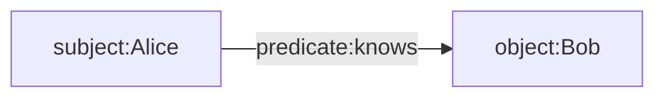

The `predicate` and `object` are themselves `Simplex`es, and thus may also be encrypted or redacted, and may in turn contain their own assertions. It is therefore possible to hide any part of an assertion by encrypting or redacting its parts:

* You can of course hide the `subject` about which assertions are made.
* You can hide the `predicate` to reveal that the `subject` and `object` are related, but hide *how* they are related,
* You can hide the `object` to assert that the subject is related in a specific way to some other hidden object,
* You can hide every part of the assertion by hiding the `subject`, `predicate`, and `object` separately, while still revealing that an assertion *exists*,
* Finally, you can hide even the fact of the assertion's existence by encrypting or redacting a `subject` containing a `Simplex`, with its assertions hidden along with it.

It is important to understand that because `Simplex` supports "complex metadata", i.e., "assertions with assertions," users are not limited to semantic triples. Adding context, as in a [semantic quad](https://en.wikipedia.org/wiki/Named_graph#Named_graphs_and_quads), is easily accomplished with an assertion on the subject. In fact, any Simplex can also be an element of a [cons pair](https://en.wikipedia.org/wiki/Cons), with the "first" element being the `subject` and the "rest" being the assertions. And since the `subject` of a `Simplex` can be any CBOR object, a `subject` can also be any structure (such as an array or map) containing other `Simplex`es.

## Digests

Each `Simplex` produces an associated `Digest`, such that if the `subject` and `assertions` of the `Simplex` are semantically identical, then the same `Digest` must necessarily be produced.

Because the order of concatenating items for a hash affects the resulting hash, the order of the elements in the `assertions` array is determined by sorting them lexicographically by the `Digest` of each assertion, and disallowing identical assertions. This ensures that an identical `subject` with identical `assertions` will yield the same `Simplex` digest, and `Simplex`s containing other `Simplex`s will yield the same digest tree.

Simplexes can be be in several forms, for any of these forms, the same digest is present for the same binary object:

* Present or referenced by SCID or Digest.
* Unencrypted or encrypted.
* Unredacted or redacted.

Thus the `Digest` of a `Simplex` identifies the `subject` and its assertions as if they were all present (dereferenced), unredacted, and unencrypted. This allowing a `Simplex` to be transformed either into or out of the various encrypted/decrypted, local/reference, and redacted/unredacted forms without changing the cumulative tree of digests. This also means that any transformations that do not preserve the digest tree invalidate the signatures of enclosing `Simplex`s.

This architecture supports selective disclosure of contents of nested `Simplex`s by revealing only the minimal objects necessary to traverse to a particular nesting path, and having done so, calculating the hashes back to the root allows verification that the correct and included contents were disclosed. On a structure where only a minimal number of fields have been revealed, a signature can still be validated.

## SCID

This proposal uses a `SCID` (Self-Certifying Identifier) type as an analogue for a [DID (Decentralized Identifier)](https://www.w3.org/TR/did-core). Both `SCID` and `Digest` may be dereferenceable through some form of distributed ledger or registry. The main difference is that the dereferenced content of a `SCID` may differ depending on what system dereferenced it or when it was dereferenced (in other words, it may be mutable), while a `Digest` always dereferences to a unique, immutable object.

Put another way, a `SCID` resolves to a *projection* of the current state of an object, while a `Digest` resolves to a specific immutable object.

## References

In the DID spec, a given DID URI is tied to a single specific method for resolving it. However, there are many cases where one may want a resource (possibly a DID document-like object) or third-party assertions about such a resource to persist in a multiplicity of places, retrievable by a multiplicity of methods. Therefore, in this proposal, one or more methods for dereferencing a `SCID` or `Digest` (analogous to DID methods) may be added to a document as assertions with the `dereferenceableVia` predicate. This allows the referent to potentially exist in many places (including local caches), with the assertions providing guidance to authoritative or recommended methods for dereferencing them.

## Signatures

Signatures have a random component, so anything with a signature will have a non-deterministic digest. Therefore, the two results of signing the same object twice with the same private key will not compare as equal, even if the same binary obect was signed by the same private key. This means that each signing is a particular event that can never be repeated.

## Simplex Notation

A simplified textual notation for interpreting `Simplex`es is provided:

* Braces `{ }` are used to delimit the contents of a nested `Simplex`.
* Top-level braces representing the outermost `Simplex` are omitted.
* Square brackets `[ ]` may come after the `subject` of a `Simplex` and are used to delimit the list of `Assertion`s.
* Type names, enumeration cases, and empty assertion lists that are obvious from context are elided.

For example, instead of writing:

```
{
    subject: .leaf("Hello"),
    assertions: [ ]
}
```

we simply write:

```
"Hello"
```

If we were to output the [CBOR diagnostic notation](https://www.rfc-editor.org/rfc/rfc8949.html#name-diagnostic-notation) for the above, we'd see:

```
49(
   60("Hello")
)
```

`49` is the CBOR tag for `Simplex` and `60` is the tag for `.leaf`. Wrapping this 5-byte UTF-8 string in a `Simplex` only adds 2 bytes (1 for each tag) and 1 byte that identifies the string's type and length, for a total of 8 bytes. CBOR (and hence `Simplex`) is therefore completely self-describing.

The `Simplex` type provides a flexible foundation for constructing solutions for various applications. Here are some high-level schematics of such applications in Simplex Notation. See the EXAMPLES chapter for more detail.

### CDDL for Simplex

```
envelope = #6.48(envelope-plaintext / envelope-encrypted)

envelope-plaintext = [ plaintext-type, payload, signatures ]

envelope-encrypted = [ encrypted-type, permit ]

plaintext-type: uint = 1
encrypted-type: uint = 2
payload: bytes
signatures: [signature]
```

### CDDL for Permit

```
permit = #6.702(permit-symmetric / permit-recipients / permit-sskr)

permit-symmetric = [ permit-symmetric-type ]
permit-recipients = [ permit-recipients-type, recipients ]
permit-sskr [ permit-sskr-type, sskr-share ]

permit-symmetric-type: uint = 1
permit-recipients-type: uint = 2
permit-sskr-type: uint = 3

recipients: [1* sealed-message]
sskr-share: crypto-sskr
```

---

## EncryptedMessage

`EncryptedMessage` is a symmetrically-encrypted message and is specified in full in [BCR-2022-001](https://github.com/BlockchainCommons/Research/blob/master/papers/bcr-2022-001-secure-message.md).

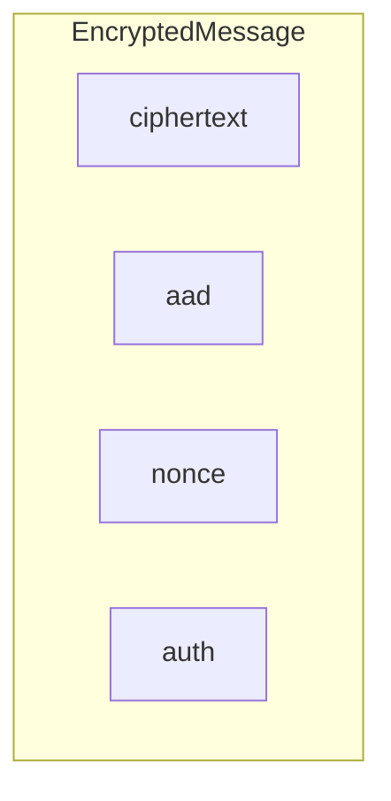

|CBOR Tag|UR Type|Swift Type|
|---|---|---|
|49|`crypto-envelope`|`Envelope`|

### CDDL for EncryptedMessage

```
crypto-msg = #6.49([ type, ciphertext, aad, nonce, auth ])

type: uint = 1          ; type 1: IETF-ChaCha20-Poly1305
ciphertext: bytes       ; encrypted using ChaCha20
aad: bytes              ; Additional Authenticated Data
nonce: bytes .size 12   ; Random, generated at encryption-time
auth: bytes .size 16    ; Authentication tag created by Poly1305
```

---

## PrivateKeyBase

`PrivateKeyBase` holds key material such as a Seed belonging to an identifiable entity, or an HDKey derived from a Seed. It can produce all the private and public keys needed to use this suite. It is usually only serialized for purposes of backup.

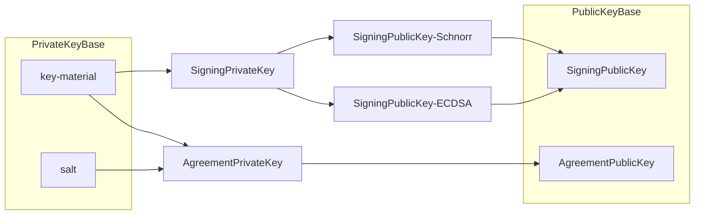

|CBOR Tag|UR Type|Swift Type|
|---|---|---|
|50|`crypto-prvkeys`|`PrivateKeyBase`|

### Derivations

* `SigningPrivateKey`: [HKDF-SHA-512](https://datatracker.ietf.org/doc/html/rfc5869) with `salt` and `info`: `signing`.
* `SigningPublicKey`: [BIP-340 Schnorr](https://github.com/bitcoin/bips/blob/master/bip-0340.mediawiki) x-only public key or [ECDSA-25519-doublesha256](https://en.bitcoin.it/wiki/BIP_0137) public key.
* `AgreementPrivateKey`: [HKDF-SHA-512](https://datatracker.ietf.org/doc/html/rfc5869) with `salt` and `info`: `agreement`.
* `SigningPrivateKey`: [RFC-7748 X25519](https://datatracker.ietf.org/doc/html/rfc7748).

### CDDL for PrivateKeyBase

```
crypto-prvkeys = #6.50([prvkeys-type, key-material, salt])

prvkeys-type: uint = 1
key-material: bytes
salt: bytes
```

---

## PublicKeyBase

`PublicKeyBase` holds the public keys of an identifiable entity, and can be made public. It is not simply called a "public key" because it holds at least _two_ public keys: one for signing and another for encryption. The `SigningPublicKey` may specifically be for verifying Schnorr or ECDSA signatures.

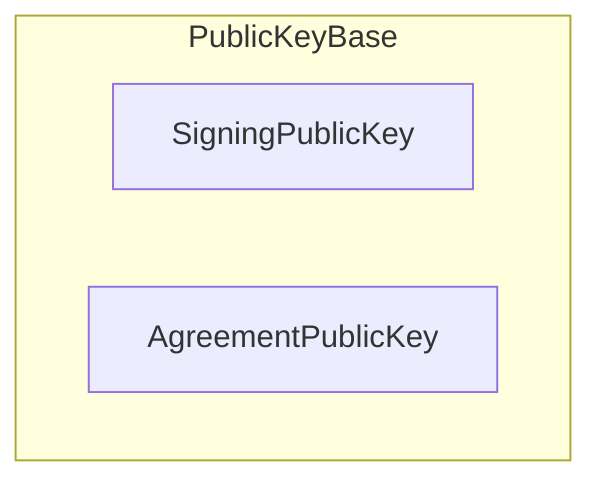

|CBOR Tag|UR Type|Swift Type|
|---|---|---|
|51|`crypto-pubkeys`|`PublicKeyBase`|

### CDDL for PublicKeyBase

```
crypto-pubkeys = #6.51([pubkeys-type, signing-public-key, agreement-public-key])

pubkeys-type: uint = 1
```

---

## SealedMessage

`SealedMessage` is a message that has been one-way encrypted to a particular `PublicKeyBase`, and is used to implement multi-recipient public key encryption using `Envelope`. The sender of the message is generated at encryption time, and the ephemeral sender's public key is included, enabling the receipient to decrypt the message without identifying the sender.

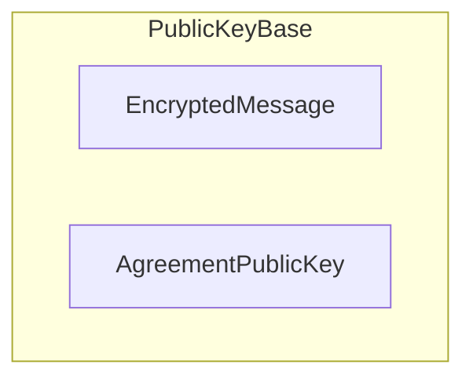

|CBOR Tag|UR Type|Swift Type|
|---|---|---|
|55|`crypto-sealed`|`SealedMessage`|

### CDDL for SealedMessage

```
crypto-sealed = #6.55([sealed-type, crypto-message, ephemeral-public-key])

sealed-type: uint = 1
ephemeral-public-key: agreement-public-key
```

---

## Digest

A Digest is a cryptographic hash of some source data. Currently Secure Components specifies the use of [blake32b](https://datatracker.ietf.org/doc/rfc7693), but more algorithms may be supported in the future.

|CBOR Tag|Swift Type|
|---|---|
|700|`Digest`|

### CDDL for Digest

```
digest = #6.700([digest-type, blake-hash])

digest-type: uint = 1       ; blake32b
blake-hash: bytes .size 32
```

---

## Password

`Password` is a password that has been salted and hashed using [scrypt](https://datatracker.ietf.org/doc/html/rfc7914), and is thereofore suitable for storage and use for authenticating users via password. To validate an entered password, the same hashing algorithm using the same parameters and salt must be performed again, and the hashes compared to determine validity. This way the authenticator never needs to store the password. The processor and memory intensive design of the scrypt algorithm makes such hashes resistant to brute-force attacks.

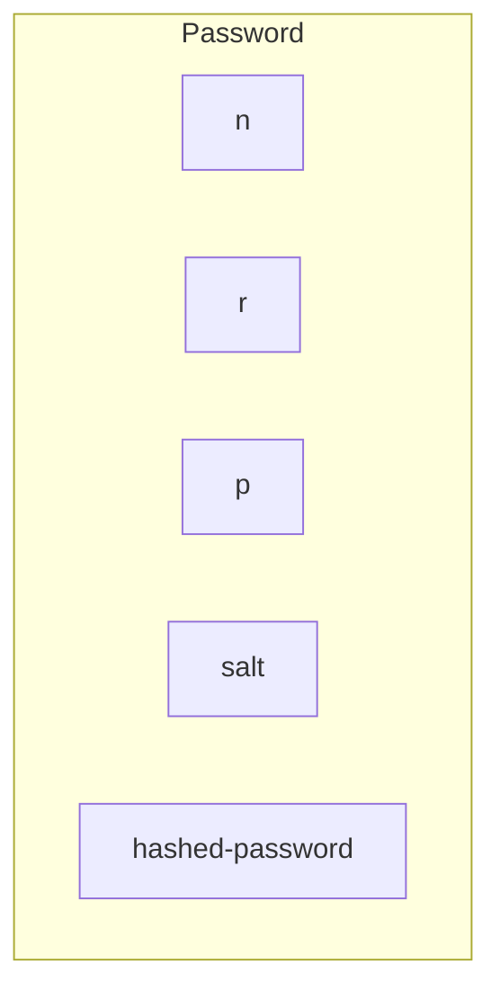

|CBOR Tag|Swift Type|
|---|---|
|701|`Password`|

### CDDL for Password

```
password = #6.701([password-type, n, r, p, salt, hashed-password])

password-type: uint = 1             ; scrypt
n: uint                             ; iterations
r: uint                             ; block size
p: uint                             ; parallelism factor
salt: bytes                         ; random salt (16 bytes recommended)
hashed-password: bytes              ; 32 bytes recommended
```

---

## AgreementPrivateKey

A Curve25519 private key used for [X25519 key agreement](https://datatracker.ietf.org/doc/html/rfc7748).

|CBOR Tag|Swift Type|
|---|---|
|703|`AgreementPrivateKey`|

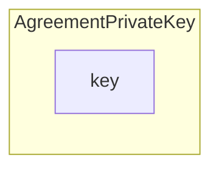

### CDDL for AgreementPrivateKey

```
private-agreement-key = #6.703([ key-type, key ])

key-type: uint = 1
key: bytes .size 32
```

---

## AgreementPublicKey

A Curve25519 public key used for [X25519 key agreement](https://datatracker.ietf.org/doc/html/rfc7748).

|CBOR Tag|Swift Type|
|---|---|
|704|`AgreementPublicKey`|

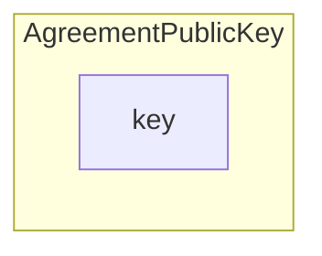

### CDDL for AgreementPublicKey

```
agreement-public-key = #6.704([ key-type, key ])

key-type: uint = 1
key: bytes .size 32
```

---

## SigningPrivateKey

A private key for creating [BIP-340 Schnorr](https://github.com/bitcoin/bips/blob/master/bip-0340.mediawiki) signatures.

|CBOR Tag|Swift Type|
|---|---|
|705|`SigningPrivateKey`||700|`Digest`|

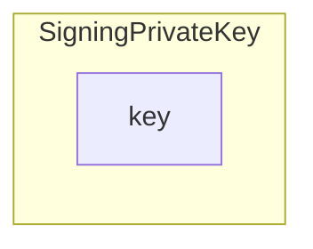

### CDDL for SigningPrivateKey

```
private-signing-key = #6.705([ key-type, key ])

key-type: uint = 1
key: bytes .size 32
```

---

## SigningPublicKey

A public key for verifying signatures. It has two variants:

* An x-only public key for verifying [BIP-340 Schnorr](https://github.com/bitcoin/bips/blob/master/bip-0340.mediawiki) signatures.
* An ECDSA key [ECDSA-25519-doublesha256](https://en.bitcoin.it/wiki/BIP_0137) signatures.

|CBOR Tag|Swift Type|
|---|---|
|706|`SigningPublicKey`|

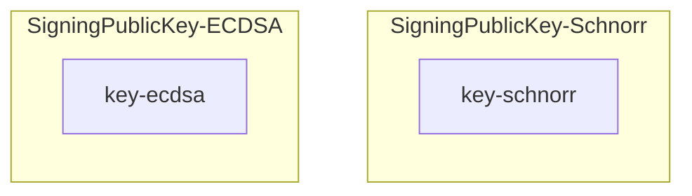

### CDDL for SigningPublicKey

```
signing-public-key = #6.706([ key-variant-schnorr / key-variant-ecdsa ])

key-variant-schnorr = (key-type-schnorr, key-schnorr)
key-type-schnorr: uint = 1
key-schnorr: bytes .size 32

key-variant-ecdsa = (key-type-ecdsa, key-ecdsa)
key-type-ecdsa: uint = 2
key-ecdsa: bytes .size 33
```

### CBOR Diagnostic Notation for SigningPublicKey

* Schnorr variant: `[1, key-schnorr]`
* ECDSA variant: `[2, key-ecdsa]`

---

## Signature

A cryptographic signature. It has two variants:

* A [BIP-340 Schnorr](https://github.com/bitcoin/bips/blob/master/bip-0340.mediawiki) signature.
* An ECDSA signature [ECDSA-25519-doublesha256](https://en.bitcoin.it/wiki/BIP_0137) signatures.

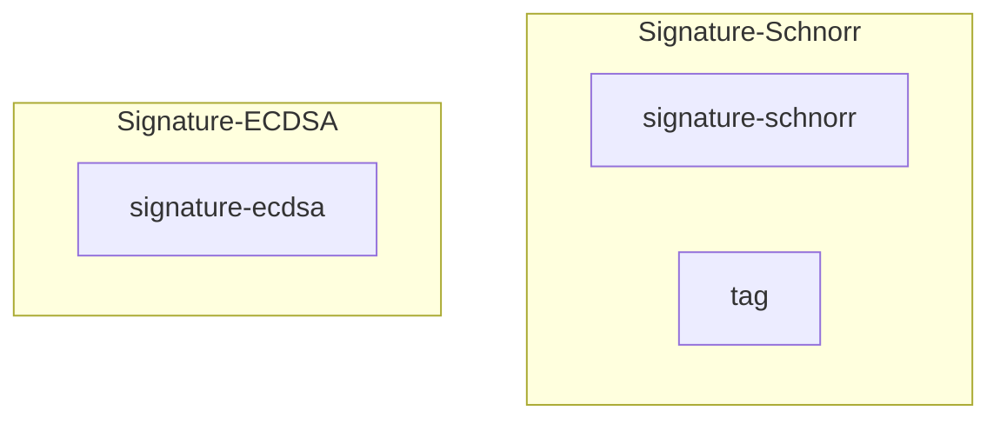

|CBOR Tag|Swift Type|
|---|---|
|707|`Signature`|

### CDDL for Signature

```
signature = #6.707([ signature-variant-schnorr / signature-variant-ecdsa ])

signature-variant-schnorr = (signature-type-schnorr, signature-schnorr, tag)
signature-type-schnorr: uint = 1
signature-schnorr: bytes .size 64
tag: bytes

signature-variant-ecdsa = (signature-type-ecdsa, signature-ecdsa)
signature-type-ecdsa: uint = 2
signature-ecdsa: bytes .size 64
```

---

## SymmetricKey

A symmetric key for encryption and decryption of [IETF-ChaCha20-Poly1305](https://datatracker.ietf.org/doc/html/rfc8439) messages.

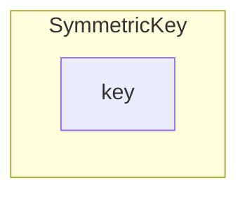

|CBOR Tag|Swift Type|
|---|---|
|708|`SymmetricKey`|

### CDDL for SymmetricKey

```
symmetric-key = #6.708([ symmetric-key-type, key ])

symmetric-key-type: uint = 1
key: bytes .size 32
```
